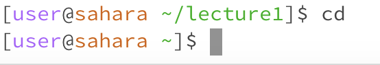
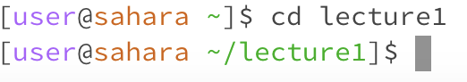
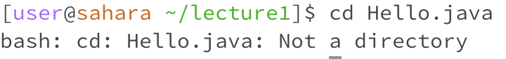
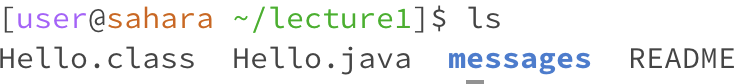
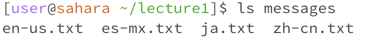
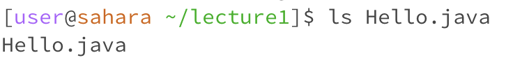
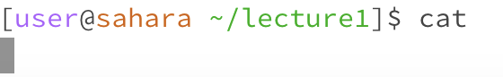
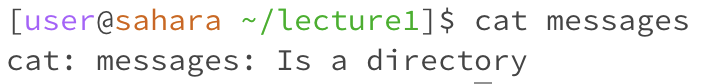
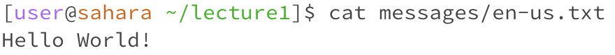

# Lab Report 1

## Instructions

1. Share an example of using the command with no arguments.
2. Share an exmaple of using the command with a path to a directory as an argument.
3. Share an example of using the command with a path to a file as an argument.

A screenshot or Markdown code block showing the command and its output
What the working directory was when the command was run
A sentence or two explaining why you got that output (e.g. what was in the filesystem, what it meant to have no arguments).
Indicate whether the output is an error or not, and if it’s an error, explain why it’s an error.

## Command 1: cd
1. cd

The working directory when the command was run was /home/lecture1.
The output now displayed [user@sahara ~]$ as the working directory since it now goes to the home directory.

3. cd lecture1

The working directory when the command was run was /home/.
I got the output now displaying [user@sahara ~/lecture1]$ as the working directory since it now changes to go to the lecture1 directory.

5. cd Hello.java
   

The working directory when the command was run was /home/lecture1.
I got the output now displaying ash: cd: Hello.java: Not a directory. The output is an error because cd is a command to change into a directory, not a file.

Command 2: ls
1. ls
   

The working directory when the command was run was /home/lecture1.
The output I got was Hello.class  Hello.java  messages  README. This is listing all the files and directories contained within the lecture1 directory.

3. ls messages
   

The working directory when the command was /home/lecture1.
The output I got was en-us.txt  es-mx.txt  ja.txt  zh-cn.txt. This displays all the files within the directory of messages.
The 

5. ls Hello.java
   

The working directory when the command was /home/lecture1.
The output I got was Hello.java. This is because it lists the file name of the fiel Hello.java.

Command 3: cat
1. cat
   

The working directory when the command was /home/lecture1.
The output I got was a blank line. This is an error since the cat command should read data from the file and gives its content as output, but instead it yields a blank line.

3. cat messages
   

The working directory when the command was /home/lecture1.
The output I got was cat: messages: Is a directory. I got this output since it the cat command reads files, but it detects that messages is a directory.

5. cat messages/en-us.txt

The working directory when the command was /home/lecture1. I got this output since the cat command reads what is inside the en-us.txt file which is Hello World!

