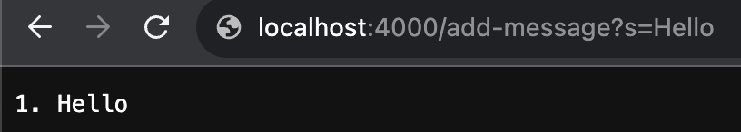
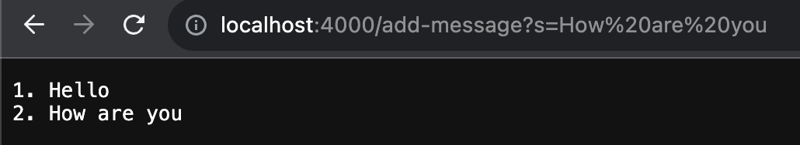
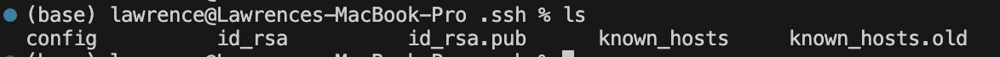
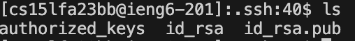
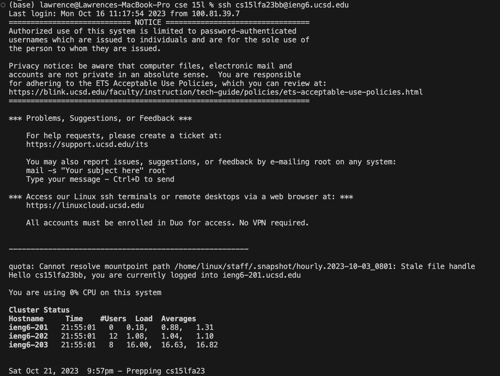

# Lab Report 2
Lawrence Ong

## Part 1 Write a web server called StringServer.

StringServer.java code
```
import java.io.IOException;
import java.net.URI;

class Handler implements URLHandler {
    // The one bit of state on the server: a number that will be manipulated by
    // various requests.
    private StringBuilder message = new StringBuilder();
    private int messageCount = 0;


    public String handleRequest(URI url) {
        String path = url.getPath(); // e.g. "/add-message"
        String query = url.getQuery(); // e.g. "message=hello"
        if (path.equals("/add-message")) {
            if (query == null) {
                return "No query string provided";
            }
            String[] parts = query.split("=");
            if (parts.length != 2) {
                return "Invalid query string";
            }
            String s = parts[1];
            messageCount++;
            message.append(messageCount + ". " + s + "\n");
            return message.toString();
        } else {
            return "0.";
        }
    }
}

class StringServer {
    public static void main(String[] args) throws IOException {
        if(args.length == 0){
            System.out.println("Missing port number! Try any number between 1024 to 49151");
            return;
        }

        int port = Integer.parseInt(args[0]);

        Server.start(port, new Handler());
    }
}
```
1st screenshot:



1st screenshot questions:
1. Which methods in your code are called?

   The methods in my code that are called are the ```main``` method from the ```StringServer``` class and the ```handleRequest``` method from the ```Handler``` class.
   The ```main``` method is responsible for getting the server up and running with the specified port number. Then, the ```handleRequest``` method
   handles the HTTP requests such as adding a new string to the list.
2. What are the relevant arguments to those methods, and the values of any relevant fields of the class?
   
   The relevant argument to ```StringServer``` would be the port number. In this case, the port number was ```4000```.
   The relevant argument to ```handleRequest(URI url)``` would be the url ```"http://localhost:4000/add-message?s=Hello"```.
   The value of the relevant fields of the class would be ```String path = url.getPath();``` which would be ```"/add-message"```
   and then for ```String query = url.getQuery();``` would be ```"message=hello"```.
   The relevant fields of the class would be ```message``` and ```messageCount```.

3. How do the values of any relevant fields of the class change from this specific request? If no values got changed, explain why.

   The values of the relevant fields of the class change from the specific request by updating message to include ```"Hello"```
   as well as updating the ```messageCount``` to 1.

2nd screenshot:



2nd screenshot questions:
1. Which methods in your code are called?
   
   The method in my code that is called is ```handleRequest``` from the ```Handler``` class.
   
2. What are the relevant arguments to those methods, and the values of any relevant fields of the class?

   The relevant argument to ```handleRequest(URI url)``` would be the url ```"http://localhost:4000/add-message?s=How%20are%20you"```.
   The value of the relevant fields of the class would be ```String path = url.getPath();``` which would be ```"/add-message"```
   and then for ```String query = url.getQuery();``` would be ```"message=How are you"```.
   The relevant fields of the class would be ```message``` and ```messageCount```.

3. How do the values of any relevant fields of the class change from this specific request? If no values got changed, explain why.

   The values of the relevant fields of the class change from the specific request by updating message to include ```"How are you"```
   as well as updating the ```messageCount``` to 2.

## Part 2 Using the command line, show with ls and take screenshots of:

Screenshot 1: The path to the private key for your SSH key for logging into ieng6 (on your computer or on the home directory of the lab computer)
The path to my private key would be ```/Users/lawrence/.ssh/id_rsa```



Screenshot 2: The path to the public key for your SSH key for logging into ieng6 (within your account on ieng6)
The path to my private key would be ```/home/linux/ieng6/cs15lfa23/cs15lfa23bb/.ssh/id_rsa.pub```



Screenshot 3: A terminal interaction where you log into ieng6 with your course-specific account without being asked for a password.



## Part 3

In a couple of sentences, describe something you learned from lab in week 2 or 3 that you didn’t know before.

In week 2, I learned how to use markdown and how to launch a server in Java.

In week 3, I learned how to use JUnit testing for Java.
