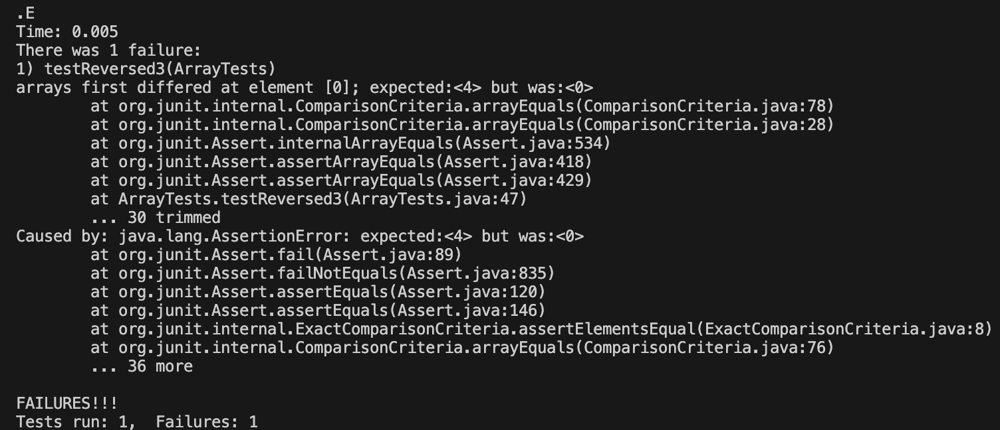
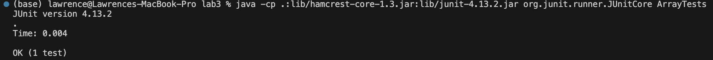

# Lab Report 3
## Part 1 - Bugs

The buggy code being used:
```
  static int[] reversed(int[] arr) {
    int[] newArray = new int[arr.length];
    for(int i = 0; i < arr.length; i += 1) {
      arr[i] = newArray[arr.length - i - 1];
    }
    return arr;
  }
```
### A failure-inducing input for the buggy program, as a JUnit test and any associated code (write it as a code block in Markdown):
```
@Test 
public void testReversed() {
    int[] input1 = { 3, 4 };
    int[] output = ArrayExamples.reverse(input1);
    assertArrayEquals(new int[]{ 4, 3 }, output);
}
```

### The symptom, as the output of running the tests (provide it as a screenshot):


### An input that doesn’t induce a failure, as a JUnit test and any associated code (write it as a code block in Markdown)
```
  @Test
  public void testReversed() {
    int[] input1 = { };
    assertArrayEquals(new int[]{ }, ArrayExamples.reversed(input1));
  }
```
### The symptom, as the output of running the tests (provide it as a screenshot):


### The bug, as the before-and-after code change required to fix it (as two code blocks in Markdown):
The for loop body needs to assign the ```newArray``` with values from the old array using the index ```arr.length - i - 1``` to be in reverse order. The old code only assigned the old array to the new array values, and the new array values only had 0, so the new array values did not change.
Also, the return statement should return ```newArray``` since it should return the new array and not the old array, since we are creating a new array.

The incorrect code:
```
  static int[] reversed(int[] arr) {
    int[] newArray = new int[arr.length];
    for(int i = 0; i < arr.length; i += 1) {
      arr[i] = newArray[arr.length - i - 1];
    }
    return arr;
  }
```

The correct code:
```
 static int[] reversed(int[] arr) {
    int[] newArray = new int[arr.length];
    for(int i = 0; i < arr.length; i += 1) {
      newArray[i] = arr[arr.length - i - 1];
    }
    return newArray;
```

## Part 2 - Researching Commands
I will use the ```grep``` command for this.

1. ```-l``` option: I found this command using the ```man grep``` command to read more about this option.

   a. Inputted Command 1:
   ```grep "base pair" -l technical/biomed/*.txt```

   b. Output 1:
```
technical/biomed/1471-2091-3-4.txt
technical/biomed/1471-2105-2-8.txt
technical/biomed/1471-2105-2-9.txt
technical/biomed/1471-2105-3-18.txt
technical/biomed/1471-2105-3-2.txt
technical/biomed/1471-2105-3-24.txt
technical/biomed/1471-2105-4-27.txt
technical/biomed/1471-2121-1-2.txt
technical/biomed/1471-2121-3-10.txt
technical/biomed/1471-213X-1-4.txt
technical/biomed/1471-2156-2-17.txt
technical/biomed/1471-2156-2-3.txt
technical/biomed/1471-2156-2-7.txt
technical/biomed/1471-2156-3-16.txt
technical/biomed/1471-2156-3-4.txt
technical/biomed/1471-2164-2-1.txt
technical/biomed/1471-2164-2-4.txt
technical/biomed/1471-2164-2-7.txt
technical/biomed/1471-2164-3-13.txt
technical/biomed/1471-2164-3-31.txt
technical/biomed/1471-2164-3-35.txt
technical/biomed/1471-2164-3-6.txt
technical/biomed/1471-2164-3-7.txt
technical/biomed/1471-2164-4-14.txt
technical/biomed/1471-2164-4-16.txt
technical/biomed/1471-2164-4-2.txt
technical/biomed/1471-2164-4-21.txt
technical/biomed/1471-2164-4-25.txt
technical/biomed/1471-2180-1-12.txt
technical/biomed/1471-2180-1-31.txt
technical/biomed/1471-2180-1-34.txt
technical/biomed/1471-2180-2-13.txt
technical/biomed/1471-2180-2-38.txt
technical/biomed/1471-2180-3-13.txt
technical/biomed/1471-2180-3-15.txt
technical/biomed/1471-2199-2-12.txt
technical/biomed/1471-2199-2-5.txt
technical/biomed/1471-2199-3-17.txt
technical/biomed/1471-2202-2-12.txt
technical/biomed/1471-2202-3-16.txt
technical/biomed/1471-2202-3-7.txt
technical/biomed/1471-2210-2-14.txt
technical/biomed/1471-2229-2-3.txt
technical/biomed/1471-2334-3-12.txt
technical/biomed/1471-2350-2-2.txt
technical/biomed/1471-2350-2-8.txt
technical/biomed/1471-2377-3-4.txt
technical/biomed/1471-2458-3-5.txt
technical/biomed/1471-2474-2-1.txt
technical/biomed/1472-6750-1-13.txt
technical/biomed/1475-4924-1-5.txt
technical/biomed/1477-7827-1-23.txt
technical/biomed/ar297.txt
technical/biomed/ar409.txt
technical/biomed/ar774.txt
technical/biomed/bcr570.txt
technical/biomed/bcr571.txt
technical/biomed/bcr602.txt
technical/biomed/bcr631.txt
technical/biomed/gb-2000-1-1-research002.txt
technical/biomed/gb-2001-2-12-research0054.txt
technical/biomed/gb-2001-2-3-research0008.txt
technical/biomed/gb-2001-2-4-research0010.txt
technical/biomed/gb-2001-2-4-research0011.txt
technical/biomed/gb-2001-2-4-research0014.txt
technical/biomed/gb-2001-2-6-research0021.txt
technical/biomed/gb-2001-2-7-research0025.txt
technical/biomed/gb-2001-2-8-research0027.txt
technical/biomed/gb-2002-3-10-research0053.txt
technical/biomed/gb-2002-3-12-research0079.txt
technical/biomed/gb-2002-3-12-research0083.txt
technical/biomed/gb-2002-3-6-research0029.txt
technical/biomed/gb-2003-4-4-r24.txt
technical/biomed/rr196.txt
```

Explanation: This command option displays all the files in the ```biomed``` directory that contain the string "base pair". This is useful to see the files that specifically mention base pair if we want to see the specifics on the files of the base pairs of DNA and RNA when talking about biology.
  
  c. Inputted Command 2:
  ``` grep "natural selection" -l technical/biomed/*.txt```
  
  d. Output 2:
  ```
technical/biomed/1471-2148-2-12.txt
technical/biomed/1471-2148-3-3.txt
technical/biomed/1471-2156-3-16.txt
technical/biomed/1471-2164-3-8.txt
technical/biomed/1471-2350-4-6.txt
technical/biomed/gb-2001-2-12-research0053.txt
technical/biomed/gb-2001-2-4-research0010.txt
technical/biomed/gb-2002-3-2-research0008.txt
technical/biomed/gb-2002-3-5-research0021.txt
technical/biomed/gb-2002-3-9-research0043.txt
technical/biomed/gb-2003-4-7-r43.txt
```

Explanation: This command option displays all the files in the ```biomed``` directory that contain the string "natural selection". This is useful to see the files that specifically mention natural selection if we want to delve into that sector of the biology of evolution.

2. ```-r``` option: I found this command using the ```man grep``` command to read more about this option.

   a. Inputted Command 1:
   ```grep "base pair" -r technical/plos/*.txt```

   b. Output 1:
```
technical/plos/journal.pbio.0020190.txt:        sequence, which is a specific series of eight base pairs in the DNA of the bacterial
technical/plos/journal.pbio.0020190.txt:        chromosomes, on the order of one or two thousand base pairs of DNA (or less—their length is
technical/plos/journal.pbio.0020223.txt:        Watson-Crick base pairing, the proximity of the synthetic reactive groups elevates their
```

Explanation: This command option displays all the lines in the biomed ```plos``` that contain the string "base pair". This is useful to see the context behind the lines of "base pair" to see if it's in the right context for biology or some other topic.
   
   c. Inputted Command 2:
   ```grep "natural selection" -r technical/biomed/*.txt```
   
   d. Output 2:
```
technical/biomed/1471-2148-2-12.txt:        natural selection favored beneficial mutations that are
technical/biomed/1471-2148-3-3.txt:        populations. Although adaptation by natural selection
technical/biomed/1471-2148-3-3.txt:        opposed to incorporated by natural selection), then fitness
technical/biomed/1471-2156-3-16.txt:          by natural selection. Thus, if the CR genes are silenced
technical/biomed/1471-2164-3-8.txt:        critical for natural selection. An important step in the
technical/biomed/1471-2350-4-6.txt:          experiencing detectably strong natural selection at that
technical/biomed/gb-2001-2-12-research0053.txt:        the least common form of natural selection observed at the
technical/biomed/gb-2001-2-4-research0010.txt:        relative roles of neutral evolution and natural selection
technical/biomed/gb-2002-3-2-research0008.txt:        it was argued that, as natural selection does not 'know'
technical/biomed/gb-2002-3-5-research0021.txt:        reproductive period is subject to natural selection, and
technical/biomed/gb-2002-3-9-research0043.txt:          pseudogenes was not constrained by natural selection on
technical/biomed/gb-2003-4-7-r43.txt:          studies of gene regulation. Because of natural selection,
```

Explanation: This command option displays all the lines' contents in the ```biomed``` directory that contain the string "natural selection". This is useful to see the context behind the lines of "natural selection" to see if it's in the right context for biology or some other topic.
3. ```-c``` option: I found about this command option here at this link: [https://www.geeksforgeeks.org/grep-command-in-unixlinux/](https://www.geeksforgeeks.org/grep-command-in-unixlinux/).

  a. Inputted Command 1:
      ```grep "base pair" -c technical/plos/journal.pbio.0020190.txt```
    
  b. Output 1
      ```2```
      
Explanation: This command option displays the number of lines that have the string "base pair" in the file ```technical/plos/journal.pbio.0020190.txt```. This is useful to see how many times "base pair" appears in that text file.

  c. Inputted Command 2:
    
    ```grep "fire" -c technical/911report/*.txt```
    
  d. Output 2
  
  ```
  technical/911report/chapter-1.txt:1
  technical/911report/chapter-10.txt:1
  technical/911report/chapter-11.txt:1
  technical/911report/chapter-12.txt:0
  technical/911report/chapter-13.1.txt:4
  technical/911report/chapter-13.2.txt:3
  technical/911report/chapter-13.3.txt:1
  technical/911report/chapter-13.4.txt:2
  technical/911report/chapter-13.5.txt:57
  technical/911report/chapter-2.txt:1
  technical/911report/chapter-3.txt:6
  technical/911report/chapter-5.txt:1
  technical/911report/chapter-6.txt:4
  technical/911report/chapter-7.txt:1
  technical/911report/chapter-8.txt:0
  technical/911report/chapter-9.txt:145
  technical/911report/preface.txt:0
  ```

Explanation: This command option displays the number of lines that have the string "fire" in the files of the ```911report``` directory. This is useful to see how many times "fire" appears in each ```.txt``` file of the ```911report``` directory.

4. ```-n``` option: I found about this command option here at this link: [https://www.geeksforgeeks.org/grep-command-in-unixlinux/](https://www.geeksforgeeks.org/grep-command-in-unixlinux/).
   
    a. Inputted Command 1:
   
    ```grep "base pair" -n technical/plos/*.txt```

   b. Output 1:
   
```
technical/plos/journal.pbio.0020190.txt:22:        sequence, which is a specific series of eight base pairs in the DNA of the bacterial
technical/plos/journal.pbio.0020190.txt:31:        chromosomes, on the order of one or two thousand base pairs of DNA (or less—their length is
technical/plos/journal.pbio.0020223.txt:46:        Watson-Crick base pairing, the proximity of the synthetic reactive groups elevates their
```

Explanation: This  command option, similar to option ```-r``` displays all the lines' contents, and it additionaly displays its line number in the file it came from that contain the string "base pair" in the ```plos``` directory. This is useful to see the context behind the lines of "base pair" to see if it's in the right context for biology or some other topic and to see its line number if we want to visit the file itself to look at the line.
    
  c. Inputted Command 2:
      ```grep "natural selection" -n technical/biomed/*.txt```
    
  d. Output 2:
  
```
technical/biomed/1471-2148-2-12.txt:390:        natural selection favored beneficial mutations that are
technical/biomed/1471-2148-3-3.txt:9:        populations. Although adaptation by natural selection
technical/biomed/1471-2148-3-3.txt:13:        opposed to incorporated by natural selection), then fitness
technical/biomed/1471-2156-3-16.txt:408:          by natural selection. Thus, if the CR genes are silenced
technical/biomed/1471-2164-3-8.txt:9:        critical for natural selection. An important step in the
technical/biomed/1471-2350-4-6.txt:335:          experiencing detectably strong natural selection at that
technical/biomed/gb-2001-2-12-research0053.txt:295:        the least common form of natural selection observed at the
technical/biomed/gb-2001-2-4-research0010.txt:43:        relative roles of neutral evolution and natural selection
technical/biomed/gb-2002-3-2-research0008.txt:34:        it was argued that, as natural selection does not 'know'
technical/biomed/gb-2002-3-5-research0021.txt:50:        reproductive period is subject to natural selection, and
technical/biomed/gb-2002-3-9-research0043.txt:254:          pseudogenes was not constrained by natural selection on
technical/biomed/gb-2003-4-7-r43.txt:104:          studies of gene regulation. Because of natural selection,
```

Explanation: This  command option, similar to option ```-r``` displays all the lines' contents, and it additionaly displays its line number in the file it came from that contain the string "bnatural selection" in the ```biomed``` diretory. This is useful to see the context behind the lines of "natural selection" to see if it's in the right context for biology or some other topic and to see its line number if we want to visit the file itself to look at the line.
